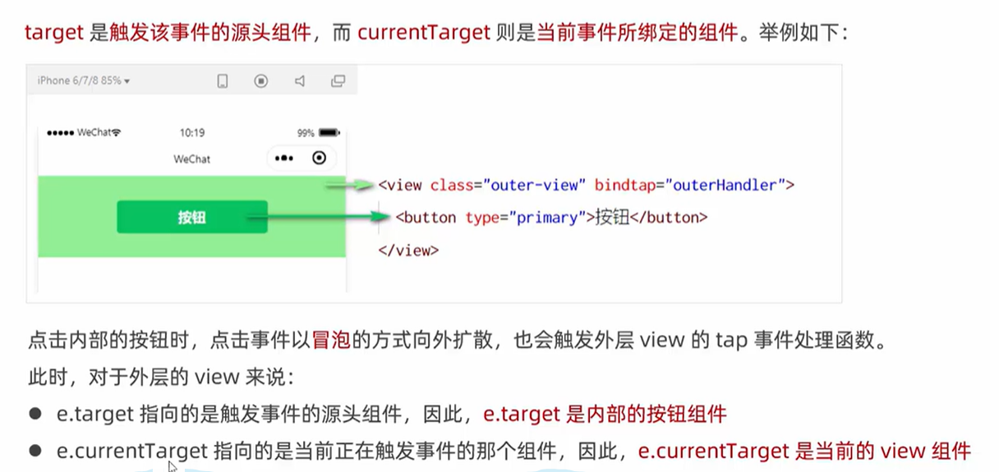

- [谈谈对有关于常用的flex属性的方法](#谈谈对有关于常用的flex属性的方法)
- [flex和grid](#flex和grid)
- [解释cookies,sessionStorage,localStorage](#解释cookiessessionstoragelocalstorage)
- [什么是跨域，如何解决跨域问题](#什么是跨域如何解决跨域问题)
- [什么是MVVM](#什么是mvvm)
- [简单说说对SPA单页面的理解，它的优缺点分别是什么](#简单说说对spa单页面的理解它的优缺点分别是什么)
- [清除浮动的方式](#清除浮动的方式)
- [居中的方式](#居中的方式)
- [rem rpx em px区别](#rem-rpx-em-px区别)
- [适配问题](#适配问题)
- [响应式布局](#响应式布局)
- [闭包](#闭包)
- [箭头函数](#箭头函数)
- [this的指向问题](#this的指向问题)
- [promise async await](#promise-async-await)
- [深拷贝和浅拷贝](#深拷贝和浅拷贝)
- [数组的常用方法有哪些](#数组的常用方法有哪些)
- [es6新特性](#es6新特性)
- [let const var区别](#let-const-var区别)
- [set和map区别](#set和map区别)
- [说一说原型链](#说一说原型链)
- [强缓存和协商缓存](#强缓存和协商缓存)
- [输入url页面的加载到底发生了什么](#输入url页面的加载到底发生了什么)
- [get和post的区别](#get和post的区别)
- [ajax和axios的区别](#ajax和axios的区别)
- [什么是盒模型](#什么是盒模型)
- [e.target和e.currentTarget的区别](#etarget和ecurrenttarget的区别)
# 谈谈对有关于常用的flex属性的方法
`flex-direction`: row/column/row-reverse/column-reverse<br>
`flex-wrap`: wrap/no-wrap<br>
`justify-content`: flex-start/flex-end/center/space-between/space-around/space-evenly<br>
`align-items`: flex-start/flex-end/center/baseline/center<br>
`align-content`: 当有多行排布的时候，例如设置了换行，就会多出来好几行
  - flex-start:几行并在一起，位于开头
  - flex-end: 几行并在一起，位于结尾
  - space-between/space-aroud/stretch类似
  
`flex-grow`:  设置给子元素，按照比例分配<br>
`flex-shrink`：设置给子元素，按照比例分配<br>
`flex-basis`:效果等同于 width=XXXpx<br>
```js
flex是flex-grow, flex-shrink, flex-basis的缩写
felx: 0: 表示 flex: 0 1 auto  不够不扩充，超过了缩放
flex: 1: 表示 flex: 1 1 auto  自动扩充
```

# flex和grid

# 解释cookies,sessionStorage,localStorage

# 什么是跨域，如何解决跨域问题

# 什么是MVVM

# 简单说说对SPA单页面的理解，它的优缺点分别是什么

# 清除浮动的方式

# 居中的方式

# rem rpx em px区别

# 适配问题

# 响应式布局

# 闭包

# 箭头函数

# this的指向问题

# promise async await

# 深拷贝和浅拷贝

# 数组的常用方法有哪些

# es6新特性

# let const var区别

# set和map区别

# 说一说原型链

# 强缓存和协商缓存

# 输入url页面的加载到底发生了什么

# get和post的区别

# ajax和axios的区别


# 什么是盒模型
html页面中任何一个元素都可以叫做盒子，它规定了元素本身和元素之间的相互关系.盒模型由内到外可以分为：content,padding,border,margin.

box-sizing有常用的两个属性
  - border-box: width和height包含padding和border
  - content-box: width和height就是内容content的宽高

几个概念
  - 内容高度：content宽高
  - 元素高度：content+padding+border
  - 元素空间高度：content+padding+border+margin

# e.target和e.currentTarget的区别
备注：如果要监听input框的变化，同时拿到里面的数据，可以用e.detail.XX来进行获取

