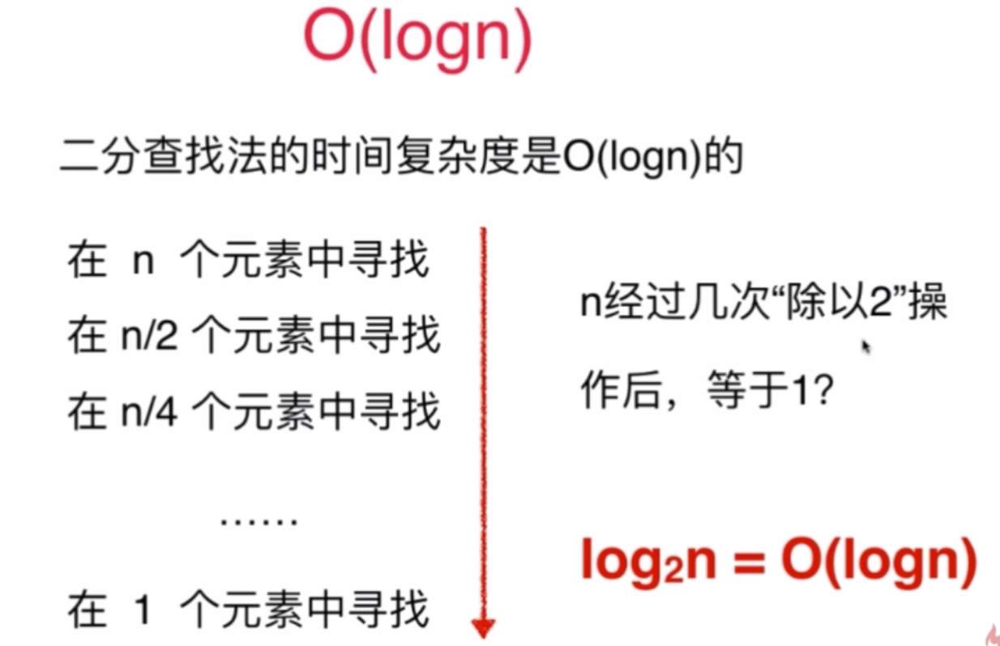
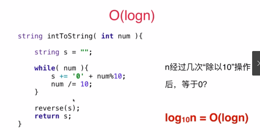

- [什么是大O](#什么是大o)
- [nlogn怎么看呢？？](#nlogn怎么看呢)
- [数组和链表的时间复杂度](#数组和链表的时间复杂度)
- [解决链表题目](#解决链表题目)
- [刷题中遇到的常见的API](#刷题中遇到的常见的api)
- [值得二刷总结](#值得二刷总结)
# 什么是大O
在计算时间复杂度的时候，n的量级对算法的影响很大，例如n的3次比n的2次，在n=1000的时候，就是1000倍的差距，即数据量越大，量级上的差距体现就越大，而系数，常数项上的影响就会越小。所以可以用一种简记的方式，这种方式被称为大O

如果想在1s内解决问题，
 - O(n^2)大约可以处理10^4级别的数据
 - O(n^1)大约可以处理10^8级别的数据
 - O(nlogn)大约可以处理10^7级别的数据


# nlogn怎么看呢？？



# 数组和链表的时间复杂度
`数组` 插入/删除：O(N) 访问/搜索：O(1)

`链表` 插入/删除：O(1) 访问/搜索：O(n)  

一个内存空间连续，需要移动元素，一个内存空间不连续，不需要移动元素


# 解决链表题目

```js
class linkNode {
      constructor(val = 0, next = null) {
        this.val = val
        this.next = next
      }
    }
    var MyLinkedList = function () {
      this.size = 0
      this.head = null
      this.tail = null

    };

    MyLinkedList.prototype.createFromList = function (array) {
      let head = new linkNode()
      let currentNode = head
      for (let i = 0; i < array.length; i++) {
        let tempNode = new linkNode(array[i])
        currentNode.next = tempNode
        currentNode = tempNode
      }
      this.size = array.length
      this.head = head.next
      this.tail = currentNode
    }
    MyLinkedList.prototype.turnToList = function (head) {
      let arr = []
      let cur = head;
      while (cur) {
        arr.push(cur.val)
        cur = cur.next
      }
      return arr
    }
    let myList = new MyLinkedList();
    myList.createFromList([1,2])
    let head = myList.head


    var reverseList = function (head) {
      if (head == null || head.next == null) {
        return head
      }
      let p = reverseList(head.next)
      // head是上一个，p是下一个
      p.next = head
      p = head
      return p
    };


    const res = reverseList(head)
    console.log((res))
```
# 刷题中遇到的常见的API
```js
/* 注意，前面要用扩展运算符 因为本来就是Math.max(1,2,3)这样写 */
Math.max([...1,2,3])

```
# 值得二刷总结

> 力扣27题：用双指针前后交汇的问题

- 写while的时候要把最前置的while(i<j写上)
- 最终停留的位置：可能是i满足条件往后移动，也有可能是j满足条件往前移动，所以最后讨论的时候要分情况讨论(可以拿2，2，3，3举例子)，如果i落在最后一个2的位置，和第一个3的位置
- 
[参考资料](https://www.bilibili.com/video/BV1sy4y1q79M?p=9&spm_id_from=pageDriver&vd_source=60248c7c7bc979b113e0ac4403b63220)

> 力扣206题：用递归的方式解决链表反转

注意：p不能动，表示最后一个元素，也就是反转后的起点，看一下视频的讲解，会变得很清晰

[参考资料](https://leetcode.cn/problems/reverse-linked-list/solution/shi-pin-jiang-jie-die-dai-he-di-gui-hen-hswxy/)


> 力扣206题：用栈的思路解绝，从后往前推，还挺不错的！！！
> 力扣389: 熟悉一下string.replace的用法


