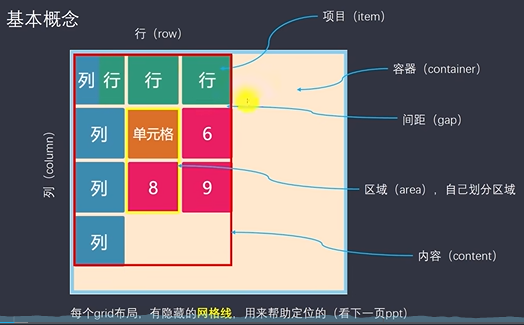

- [谈谈对有关于常用的flex属性的方法](#谈谈对有关于常用的flex属性的方法)
- [谈谈grid布局常用的属性](#谈谈grid布局常用的属性)
# 谈谈对有关于常用的flex属性的方法
`flex-direction`: row/column/row-reverse/column-reverse<br>
`flex-wrap`: wrap/no-wrap<br>
`justify-content`: flex-start/flex-end/center/space-between/space-around/space-evenly<br>
`align-items`: flex-start/flex-end/center/baseline/center<br>
`align-content`: 当有多行排布的时候，例如设置了换行，就会多出来好几行
  - flex-start:几行并在一起，位于开头
  - flex-end: 几行并在一起，位于结尾
  - space-between/space-aroud/stretch类似
  
`flex-grow`:  设置给子元素，按照比例分配<br>
`flex-shrink`：设置给子元素，按照比例分配<br>
`flex-basis`:效果等同于 width=XXXpx<br>
```js
flex是flex-grow, flex-shrink, flex-basis的缩写
felx: 0: 表示 flex: 0 1 auto  不够不扩充，超过了缩放
flex: 1: 表示 flex: 1 1 auto  自动扩充
```

# 谈谈grid布局常用的属性

最外层是container, container里面包含content(网格区域)， conteng里是一块块area, 每一块area里面有item, 每一块area之间有gap

`grid-template-colums grid-template-rows`:设置长宽分为几行几列 

  ```js
  除了上面的写法，还有一些特殊写法
  - grid-template-columns: repeat(3, 100px); 每一行放三个，每个的宽度是100px
  - grid-template-columns: 100px auto 100px; auto自动充满空余区域
  - grid-template-columns: repeat(auto-fill, 100px); 按照盒子的大小，直到布满，再顺延到第二行
  - grid-template-columns: repeat(4, 1fr); 按照盒子的大小，宽度平均分成4份  那如果是1：2：3呢？  grid-template-columns: 1fr 2fr 3fr
  - grid-template-columns: 1fr minmax(150px, 1fr) ： 表示最小是150px, 最大是1fr。效果就是，当页面>=300px的时候，那么两列平均分，小于300px的时候，第二列保持150px，第一列在减小
  ```

  `row-gap, column-gap, gap` : 行间距，列间距，统一写法(第一个参数表示行，第二个参数表示列)

  `grid-auto-flow: column/row`: 设置area的排列方式(沿着row还是column方向)

  `grid-auto-columns grid-auto-rows`:设置超出content返回的元素的尺寸

  `justify-items align-items`:设置item的布局 start/end/center/strech

  `justify-content align-content`: 设置content布局 start/end/center/strech/space-between/space-around/space-evenly

  以上是设置在container类上，以下属性设置给具体的item

  `grid-colunm-start grid-column-end grid-row-start grid-row-end`： 从第几根轴到第几根轴，简写 grid-column: 1 / 3: 从第一根轴到第三根轴

  `grid-area`: 终极简写; grid-area: 1 / 3 / 2 / 4  column方向从1到2， row方向从3到4(是错开的)

  `align-self justify-self`: 单独定义自己的展示方式，可以覆盖align-items justify-items

  具体的演示可以参考自己整理的html文件
  
  总结以下：flex和grid都是对一个容器内的元素进行布局，flex只有主轴和侧轴，grid则类似于栅格布局
 


