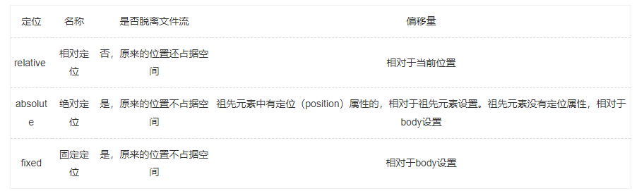

- [](#)
- [transform transition animation](#transform-transition-animation)
- [css中什么是伪类](#css中什么是伪类)
- [css权重问题](#css权重问题)
- [1rem、1em、1vh、1px各自代表的含义？](#1rem1em1vh1px各自代表的含义)
- [如何监听屏幕大小](#如何监听屏幕大小)
- [媒体查询如何实现，移动端适配如何实现？](#媒体查询如何实现移动端适配如何实现)
- [双飞翼布局 圣杯布局（左右定宽，中间自适应是怎么实现的，有什么方法 实现css三栏布局，中间固定，两边自适应](#双飞翼布局-圣杯布局左右定宽中间自适应是怎么实现的有什么方法-实现css三栏布局中间固定两边自适应)
- [画一个三角形](#画一个三角形)
- [一些不熟悉的css样式](#一些不熟悉的css样式)
- [谈谈对有关于常用的flex属性的方法](#谈谈对有关于常用的flex属性的方法)
- [谈谈grid布局常用的属性](#谈谈grid布局常用的属性)
- [居中的方式](#居中的方式)
- [清除浮动的方式](#清除浮动的方式)
- [其他](#其他)

# 如何制作轮播图

利用setInterval或者是animation不断改变margin-left的值

# 如何实现.5px的边框
[参考资料](https://blog.csdn.net/baogeprh/article/details/123183114)

# css中宽度随内容自适应，如何实现
注意：如果没有设置宽度的话，默认继承父元素的宽度，所以很可能是100%。

`width: fit-content;` // 内容自适应
# BFC 
[参考资料](https://www.xiaohongshu.com/discovery/item/6308d51b000000001b006abc?app_platform=android&app_version=7.55.0&share_from_user_hidden=true&type=normal&xhsshare=WeixinSession&appuid=5fe094d4000000000101d940&apptime=1662949214)

# 定位

# 选择器

`标签选择器`

直接用标签名

`id选择器`

#id名

`类选择器`

.类名，注意可以有多个，但是id名只能有一个

`后代选择器`

标签名称1 标签名称2

后代选择器必须**用空格隔开** 后代不仅仅是儿子, **也包括孙子/重孙子**, 只要最终是放到指定标签中的都是后代

后代选择器不仅仅可以使用标签名称, 还可以使用其它选择器

后代选择器可以通过空格一直延续下去

先找到所有名称叫做"标签名称1"的标签, 然后再在这个标签下面去查找所有名称叫做"标签名称2"的标签, 然后在设置属性。

`子元素选择器`

标签名称1>标签名称2

子元素选择器之间需要用&gt;符号连接, 并且不能有空格

子元素选择器只会查找儿子, 不会查找其他被嵌套的标签

子元素选择器可以通过>符号一直延续下去

`交集选择器`

选择器1选择器2

选择器和选择器之间没有任何的连接符号

**<u>并集选择器</u>**
选择器1,选择器2
给选择器1，选择器2都添加上某种样式

`相邻兄弟选择器`

选择器1+选择器2

相邻兄弟选择器只能选中紧跟其后的那个标签, 不能选中被隔开的标签

`通用兄弟选择器`

div~h2

通用兄弟选择器选中的是指定选择器后面某个选择器选中的所有标签, 无论有没有被隔开都可以选中

`序列选择器`

[请参考这篇文字](https://blog.csdn.net/mianmami/article/details/117913056)

`属性选择器`
根据对应的属性选择标签。(下面的E是标签名)

E[att]{}：选取含有某种属性的元素

E[att=“val”]：选取带有指定属性和值的元素

E[att^=“val”]：属性以指定元素开头

E[att$=“val”]：属性以指定元素结尾

E[att*=“val”]: 选取属性值中包含指定词汇的元素，只要包含这个单词即可。

E[att~=“val”]：选取属性值中包含指定词汇的元素，需要是一个独立的单词，被空格分开。


最常见的应用场景, 就是用于区分input属性 input[type=password]{}

如果想要选择包含某属性的全部元素，可以这样写:
[attr]{
}
或者是
.demo[att]，就是类名为demo，又包含att属性的元素。
**通配符选择器**
*

`伪元素选择器`
```html
<!DOCTYPE html>
<html lang="en">
<head>
    <meta charset="UTF-8">
    <title>68-伪元素选择器</title>
    <style>
        *{
            margin: 0;
            padding: 0;
        }
        div{
            width: 200px;
            height: 200px;
            background-color: red;
        }
        /*
        p{
            width: 50px;
            height: 50px;
            background-color: pink;
        }
        */

        div::before{
            content: "爱你";
            width: 50px;
            height: 50px;
            background-color: pink;
            display: block;
        }
        div::after{
            /*指定添加的子元素中存储的内容*/
            content: "么么哒";
            /*指定添加的子元素的宽度和高度*/
            width: 50px;
            /*height: 50px;*/
            /*内容是可以超出标签的范围的, 所以高度为0依然可以看见内容*/
            height:0px;
            background-color: pink;
            /*指定添加的子元素的显示模式*/
            display: block;
            /*隐藏添加的子元素*/
            /*visibility: hidden;*/
        }

    </style>
</head>
<body>
<!--
1.什么是伪元素选择器?
伪元素选择器作用就是给指定标签的内容前面添加一个子元素或者给指定标签的内容后面添加一个子元素

2.格式:
标签名称::before{
    属性名称:值;
}
给指定标签的内容前面添加一个子元素

标签名称::after{
    属性名称:值;
}
给指定标签的内容后面添加一个子元素

-->
<div>
    <!--<p>爱你</p>-->
    我是文字
    <!--<p>么么哒</p>-->
</div>

</body>
</html>
```
关于优先级的问题：

行内样式 > id选择器 > 类选择器 > 标签选择器

# 伪类和伪元素

- 伪类能出现多次，而伪元素只能出现一次
- 伪类：:nth-of-type(1)这种, 伪元素: ::after()这种
- 伪类本质上是给元素创建多一个类名，多个类名多个效果
- 伪元素本质上是创建了一个有内容的虚拟容器，也就是多了一个dom节点(元素)
- CSS3中伪类和伪元素的语法不同，伪元素一般是:: , 伪类是:
  
  [参考资料](https://blog.csdn.net/runner_123/article/details/79851329)

# 关于opacity:0、visibility:hidden、display:none三个属性的比较以及拓展
[参考资料](https://blog.csdn.net/weixin_38080573/article/details/79435869)

# input标签的默认宽度
[参考资料](https://blog.csdn.net/laiyangwen1120/article/details/78427384/)

# line-height1.5和line-height:150%的区别
[参考资料](https://blog.csdn.net/qq_40685439/article/details/109138034)
注意：默认的font-size大小是16px

# transform transition animation

- transition是过渡，强调样式值得变化过程，只有开始和结束；需要通过hover或js等事件来配合触发；只能触发一次
- animation也叫关键帧，通过@keyframe结合可以设置中间帧得一个状态(可以通过from...to...或者百分号来进行设置)；且可以不触发事件就触发过程；可触发多次
- transform是转换，指的是改变元素得外观，没有动画效果，唰的一下就改变了(可以理解了某一个状态)

[参考资料](https://www.cnblogs.com/ypppt/p/13363747.html)
# css中什么是伪类
[参考资料](https://www.w3school.com.cn/css/css_pseudo_classes.asp)
# css权重问题
- 然后要提一下 !important 是具有最高的权重即可
- 通配符，相邻选择器，子选择器的权重是0
- 继承的样式没有权重


[参考资料](https://blog.csdn.net/weixin_55017780/article/details/117667113)

# 1rem、1em、1vh、1px各自代表的含义？

 - em： 等于当前这个元素内部的字体大小，字体默认是16px, 那么1em = 16px
 - rem: 在根节点设置了一个font-size = XX,那么全局 1rem = XX。rem和em都是相对的单位，会随着字体大小而变化
 - 1vw: 表示当前屏幕宽度的1% ， 1vh：当前屏幕高度的1%
 - vmin: vw和vh中较小的那个
 - vmax: vw和vh中较大的那个 这两个可以用于屏幕旋转的时候保持尺寸不变

`物理像素`：就是实际的像素点，有多少个空格

`逻辑像素`：是人为设定的，例如苹果手机逻辑像素宽度方向才300多，但是实际的物理像素却有800多。所以1个逻辑像素会对于多个物理像素，可以理解了图片放大，就失真了。

`视口`：现在屏幕的宽度假设是375，但是视口默认是980， 所以页面放不下，一个视口，而如果强行放下的话，为了让页面全部显示，就会缩放。这样也是不合理的。所以后来就引入了meta标签，去定义一些属性值来约束视口，例如有属性 content="width=device-width initial-scale等

`目前比较常用的做法`：先把视口设置为和屏幕宽度大小一样，此时，如果按照原来设计稿的尺寸肯定是放不下的。然后可以通过rem来进行缩放。最后，就是逻辑像素和物理像素的问题，就可以通过initial-scale来对整个视口进行缩放

`当然还有一些比较简单的做法`，例如，直接通过媒体查询，或者不管屏幕大小，始终保持字体、图片大小，但是给最外层的容器添加flex布局，让整体可以进行伸缩。

[参考资料](https://www.bilibili.com/video/BV1Gu411o7CP?spm_id_from=333.337.search-card.all.click&vd_source=60248c7c7bc979b113e0ac4403b63220)

# 如何监听屏幕大小

window.onresize = function

window.addEventListener('resize', function)

获取网页的宽高

document.body.clientWidth;

document.body.clientHeight;


# 媒体查询如何实现，移动端适配如何实现？

[媒体查询](https://blog.csdn.net/dream_lifes/article/details/122013152)

[参考资料](https://blog.csdn.net/qq_36303853/article/details/99717724)


# 双飞翼布局 圣杯布局（左右定宽，中间自适应是怎么实现的，有什么方法 实现css三栏布局，中间固定，两边自适应

  - 圣杯三个平级，用padding挤
  - 双飞翼center里面包一个，用margin挤，这个更加好写 注意，float之间的maring，是可以覆盖上去的
  - 看文件夹里的案例


# 画一个三角形
由于边框具有宽度，且在边框的交界处会有45°的夹角，所有可以将不想显示的border的颜色设置为transparent即可。

[参考资料](https://blog.csdn.net/weixin_43900271/article/details/114637983)

# 一些不熟悉的css样式
```js
letter-spacing: 一句话每个词语之间的间距
```

# 谈谈对有关于常用的flex属性的方法
`flex-direction`: row/column/row-reverse/column-reverse<br>
`flex-wrap`: wrap/no-wrap<br>
`justify-content`: flex-start/flex-end/center/space-between/space-around/space-evenly<br>
`align-items`: flex-start/flex-end/center/baseline/center<br>
`align-content`: 当有多行排布的时候，例如设置了换行，就会多出来好几行
  - flex-start:几行并在一起，位于开头
  - flex-end: 几行并在一起，位于结尾
  - space-between/space-aroud/stretch类似
  
`flex-grow`:  设置给子元素，按照比例分配<br>
`flex-shrink`：设置给子元素，按照比例分配<br>
`flex-basis`:效果等同于 width=XXXpx<br>
```js
flex是flex-grow, flex-shrink, flex-basis的缩写
felx: 0: 表示 flex: 0 1 auto  不够不扩充，超过了缩放
flex: 1: 表示 flex: 1 1 auto  自动扩充
```

# 谈谈grid布局常用的属性

最外层是container, container里面包含content(网格区域)， conteng里是一块块area, 每一块area里面有item, 每一块area之间有gap

`grid-template-colums grid-template-rows`:设置长宽分为几行几列 

  ```js
  除了上面的写法，还有一些特殊写法
  - grid-template-columns: repeat(3, 100px); 每一行放三个，每个的宽度是100px
  - grid-template-columns: 100px auto 100px; auto自动充满空余区域
  - grid-template-columns: repeat(auto-fill, 100px); 按照盒子的大小，直到布满，再顺延到第二行
  - grid-template-columns: repeat(4, 1fr); 按照盒子的大小，宽度平均分成4份  那如果是1：2：3呢？  grid-template-columns: 1fr 2fr 3fr
  - grid-template-columns: 1fr minmax(150px, 1fr) ： 表示最小是150px, 最大是1fr。效果就是，当页面>=300px的时候，那么两列平均分，小于300px的时候，第二列保持150px，第一列在减小
  ```

  `row-gap, column-gap, gap` : 行间距，列间距，统一写法(第一个参数表示行，第二个参数表示列)

  `grid-auto-flow: column/row`: 设置area的排列方式(沿着row还是column方向)

  `grid-auto-columns grid-auto-rows`:设置超出content返回的元素的尺寸

  `justify-items align-items`:设置item的布局 start/end/center/strech

  `justify-content align-content`: 设置content布局 start/end/center/strech/space-between/space-around/space-evenly

  以上是设置在container类上，以下属性设置给具体的item

  `grid-colunm-start grid-column-end grid-row-start grid-row-end`： 从第几根轴到第几根轴，简写 grid-column: 1 / 3: 从第一根轴到第三根轴

  `grid-area`: 终极简写; grid-area: 1 / 3 / 2 / 4  column方向从1到2， row方向从3到4(是错开的)

  `align-self justify-self`: 单独定义自己的展示方式，可以覆盖align-items justify-items

  具体的演示可以参考自己整理的html文件
  
  总结以下：flex和grid都是对一个容器内的元素进行布局，flex只有主轴和侧轴，grid则类似于栅格布局
 
# 居中的方式

`行内元素水平居中`: text-align: center

`行内元素垂直居中`: line-height: 设置为和父元素高度一致即可

`块级元素水平居中`: margin: 0 auto

`块级垂直水平居中`: 

  - 子绝父相 + left/top: 50% + marigin-left/margin-top: 元素本身宽高的一半(需要知道儿子的宽高)
  - 子绝父相 + left/top: 50% + transform: translate(-50%)
  - 子绝父相 + left/top/bottom/right: 0 + margin: auto
  - 父元素不设置宽高，子元素通过padding撑开父元素
  - 弹性盒布局:  display： flex + justity-content: center + align-items: center
  - grid 布局： 父亲：display: grid  儿子： justify-self: center; align-self: center
# 清除浮动的方式
- 父元素没有设置高度，子元素设置为浮动，导致父元素高度塌陷。所以最直接的方式是给父元素一个高度
- 给父元素设置overflow: hidden/auto
- 在原来的子元素下方再加入一个子元素，并设置clear: both。即清除左边的浮动元素，又清除右边的浮动元素
- 现在比较常用的：原理和3是一样的，就是通过伪类元素，来虚拟地添加一个高度为0，内容为空的元素(最为推荐哦)

# 其他

- 如果给float的元素添加margin-left: 那么会覆盖在左边的元素上
- flex布局里的元素设置margin,如果空间不够的话，原来的元素会缩小
- 父元素相对定位，子元素绝对定位，如果给给子元素设置Left:0,right:0,那么默认就是设置子元素的宽，可以通过调节left,right来设置子元素的宽度
- 在定位元素中，父元素的z-index小于兄弟元素的z-index时候，父元素中子元素的z-index再高，也不会覆盖父元素的兄弟元素
- 给padding设置百分比的时候，相对的是包含块的宽度，而不是高度
- 隐藏文本：font-size: 0px;
- 对于图片的设置：object-fit: contain（包含图片） cover（保持宽高比）
- filter: blur(1.5px) 虚化，看起来像毛玻璃
- [postoin:sticky的使用方法](https://www.jb51.net/css/716126.html)

# 其他

- 把鼠标移到按钮并点击时，会产生一串什么样的事件？ hover active foucus
- 行内元素与浮动元素发生重叠，其边框，背景和内容都会显示在浮动元素之下(错误：边框背景会被遮盖，但是内容会被挤下来)
- 注意：是padding不能直接从顶部挤下来，margin是可以的。


