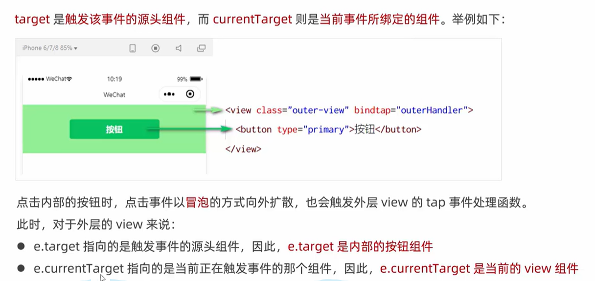

- [解释cookies,sessionStorage,localStorage](#解释cookiessessionstoragelocalstorage)
- [什么是MVVM](#什么是mvvm)
- [简单说说对SPA单页面的理解，它的优缺点分别是什么](#简单说说对spa单页面的理解它的优缺点分别是什么)
- [清除浮动的方式](#清除浮动的方式)
- [居中的方式](#居中的方式)
- [rem rpx em px区别](#rem-rpx-em-px区别)
- [适配问题](#适配问题)
- [响应式布局](#响应式布局)
- [闭包](#闭包)
- [promise async await](#promise-async-await)
- [深拷贝和浅拷贝](#深拷贝和浅拷贝)
- [es6新特性](#es6新特性)
- [let const var区别](#let-const-var区别)
- [set和map区别](#set和map区别)
- [说一说原型链](#说一说原型链)
- [强缓存和协商缓存](#强缓存和协商缓存)
- [输入url页面的加载到底发生了什么](#输入url页面的加载到底发生了什么)
- [get和post的区别](#get和post的区别)
- [ajax和axios的区别](#ajax和axios的区别)
- [什么是盒模型](#什么是盒模型)
- [e.target和e.currentTarget的区别](#etarget和ecurrenttarget的区别)

# 解释cookies,sessionStorage,localStorage

# 什么是MVVM

# 简单说说对SPA单页面的理解，它的优缺点分别是什么

# 清除浮动的方式

# 居中的方式

# rem rpx em px区别

# 适配问题

# 响应式布局

# 闭包

# promise async await

# 深拷贝和浅拷贝

# es6新特性

# let const var区别

# set和map区别

# 说一说原型链

# 强缓存和协商缓存

# 输入url页面的加载到底发生了什么

# get和post的区别

# 什么是盒模型
html页面中任何一个元素都可以叫做盒子，它规定了元素本身和元素之间的相互关系.盒模型由内到外可以分为：content,padding,border,margin.

box-sizing有常用的两个属性
  - border-box: width和height包含padding和border
  - content-box: width和height就是内容content的宽高

几个概念
  - 内容高度：content宽高
  - 元素高度：content+padding+border
  - 元素空间高度：content+padding+border+margin

# e.target和e.currentTarget的区别
备注：如果要监听input框的变化，同时拿到里面的数据，可以用e.detail.XX来进行获取

