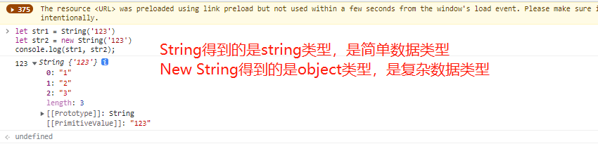
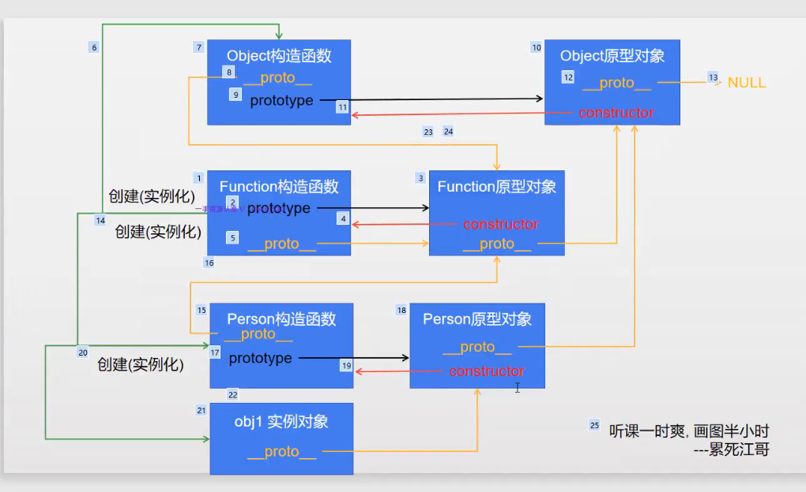

- [](#)
- [String和 new String的区别](#string和-new-string的区别)
- [js代码有问题，编译器是如何识别报错的](#js代码有问题编译器是如何识别报错的)
- [js事件循环机制](#js事件循环机制)
- [箭头函数和普通函数的区别](#箭头函数和普通函数的区别)
- [Commonjs和es6模块的区别](#commonjs和es6模块的区别)
- [如何创建一个m*n的二维数组(用一行代码，全部用0填充)](#如何创建一个mn的二维数组用一行代码全部用0填充)
- [函数的rest参数](#函数的rest参数)
- [对象的解构赋值](#对象的解构赋值)
- [Proxy 和 Object.defineProperty的区别](#proxy-和-objectdefineproperty的区别)
- [什么是Reflect](#什么是reflect)
- [字符串模板](#字符串模板)
- [使用ES6设计一个计数器](#使用es6设计一个计数器)
- [一句话找到数据的最大值](#一句话找到数据的最大值)
- [数据类型有哪些，他们的区别是什么？](#数据类型有哪些他们的区别是什么)
- [实现深拷贝](#实现深拷贝)
- [instanceof如何实现](#instanceof如何实现)
- [如何实现数组去重](#如何实现数组去重)
- [js中哪些数据是false](#js中哪些数据是false)
- [js如何判断数据类型](#js如何判断数据类型)
- [typeof 的用法](#typeof-的用法)
- [ES6 set的底层实现原理](#es6-set的底层实现原理)
- [构造函数中new在执行时都做了哪些事情？](#构造函数中new在执行时都做了哪些事情)
- [this的指向问题，如何修改this的指向, 箭头函数能否实例化？](#this的指向问题如何修改this的指向-箭头函数能否实例化)
- [讲一下E6类和继承](#讲一下e6类和继承)
- [js原生的绑定点击事件](#js原生的绑定点击事件)
- [Generator/Iterator/Async/Await](#generatoriteratorasyncawait)
- [原型链](#原型链)
- [AMD和CMD](#amd和cmd)
- [如何判断一个数据是数组类型](#如何判断一个数据是数组类型)
- [闭包](#闭包)
- [let const var区别](#let-const-var区别)
- [深拷贝和浅拷贝](#深拷贝和浅拷贝)
- [什么是JS垃圾回收机制](#什么是js垃圾回收机制)
- [Object .is 和 == 和 === 有什么区别](#object-is-和--和--有什么区别)
- [数组Api](#数组api)
- [Map Api](#map-api)
- [Set API](#set-api)
- [ObjectAPi](#objectapi)
- [NumberAPI](#numberapi)
- [SymbolAPI](#symbolapi)
- [字符串API](#字符串api)
- [其他](#其他)
# undefined和null的区别
[参考资料](https://blog.csdn.net/m0_47135993/article/details/119800231)

# js精度问题
[参考资料](https://www.cnblogs.com/94pm/p/15990601.html)

# less和sass的区别
[参考资料](https://blog.csdn.net/JoeBlackzqq/article/details/98885880)

# ParseInt用法
[参考资料](https://blog.csdn.net/zebghfv/article/details/118938270)
- 0x开头，16进制
- 数字开头，解析数字(后面如果有字母，舍弃不要)
- 字母开头，返回NAN

# Promise相关知识

- promise状态一旦发生更改，就不能改变
```js
let p = new Promise((resolve, reject) =>{
  resolve(1)
})

p.then((data)=>{
  console.log(data);
  p.then((data)=>{
    console.log(data);
  })
})
// 两次得到的数据是一样的
```
- promise初始化的时候，内部的代码是同步任务代码
```js
let p = new Promise((resolve, reject) =>{
  console.log(1); // 先执行
})
console.log(2);
```
- promise.then中执行的内容在微任务队列中，优先级要高于异步任务队列(可以理解为宏任务队列) 同步任务 -> 微任务 -> 宏任务

- promise的静态方法
```js
let p1 = Promise.resolve(1) // 返回一个成功的promise
let p2 = Promise.reject(2) // 返回一个失败的Promise
p1.then((res)=>{
  console.log(res); //1
})
p2.catch((err)=>{
  console.log(err); //2
})

```
- thenable
```js
let p = Promise.resolve({
  name: 18,
  then(resolve, reject){
    resolve(1) // 如果一个对象有then属性，那么就称这个是thenable的。。。
  }
})
p.then(res=>{
  console.log(res); // 这里不会返回一个对象，而是返回then中resolve中传递的值
})

```
[参考资料](https://blog.csdn.net/weixin_33753845/article/details/91478557)

- 链式调用的一些知识点

```js
// 简单点来说就是：每次调用函数时，它只接受一部分参数，并返回一个函数，直到传递所有参数为止。

function add (...args) {
  //求和
  return args.reduce((a, b) => a + b)
}

function currying (fn) {
  let args = []
  return function temp (...newArgs) {
      if (newArgs.length) {
          args = [
              ...args,
              ...newArgs
          ]
          return temp
      } else {
          let val = fn.apply(this, args)
          args = [] //保证再次调用时清空
          return val
      }
  }
}

let addCurry = currying(add)
console.log(addCurry(1)(2)(3)(4, 5)())  //15
console.log(addCurry(1)(2)(3, 4, 5)())  //15
console.log(addCurry(1)(2, 3, 4, 5)())  //15


// 状态依赖
// p4是要晚于p5执行，且p5中沿用了p4中reject的状态(按道理，p4是注册成功的回调，但是跟随p5注册了失败的回调)
let p4 = new Promise((resolve, reject)=>{
  setTimeout(()=>{
    reject('我是失败回调的数据')
  }, 3000)
})

let p5 = new Promise((resolve, reject)=>{
  setTimeout(()=>{
    resolve(p4)
  })
})

p5.then((res)=>{
  console.log('我是成功的回调');
})
p5.catch((err)=>{
  console.log('我是失败的回调', err);
})
```
- Promise.all 

```js
// Promise.all会等待最长的一个Promise执行完毕，再返回结果，只要有一个发生错误，就返回错误的结果

```

# arguments是数组吗？ （js）
[参考资料](https://blog.csdn.net/weixin_43677787/article/details/122531449)

# String和 new String的区别
一个是普通数据类型，一个是复杂数据类型

console.log( typeof str1 ); //string

console.log( typeof str2 ); //object




[参考资料](https://blog.csdn.net/u012174809/article/details/124446344)


# js代码有问题，编译器是如何识别报错的

  [这个好像不算是答案，但是能帮我看一下如何处理异常](https://juejin.cn/post/6862225202332794894)

# js事件循环机制

- 遇到同步任务，直接放入call stack
- 遇到异步任务，调用web Apis
- web apis执行完毕，把其中的回调函数加入callback queue
- 事件轮询，不断监测call stack和callback queue，如果call stack空闲，就开始执行callback queue中的任务

- 注意settimeout如果延迟事件写0，不是马上执行，其默认延迟时间是4ms,且，只有主线程空闲，它才能调用，如果主线程一直阻塞，那么它可能永远停滞
- 注意：回答的时候，要提到js是单线程，所以有异步任务，所以有事件轮询(回调函数)

[参考资料](https://blog.csdn.net/CherryCola_zjl/article/details/112007310?spm=1001.2101.3001.6661.1&utm_medium=distribute.pc_relevant_t0.none-task-blog-2%7Edefault%7ECTRLIST%7ERate-1-112007310-blog-125029860.pc_relevant_multi_platform_whitelistv4eslandingctr2&depth_1-utm_source=distribute.pc_relevant_t0.none-task-blog-2%7Edefault%7ECTRLIST%7ERate-1-112007310-blog-125029860.pc_relevant_multi_platform_whitelistv4eslandingctr2&utm_relevant_index=1)

[参考资料](https://www.jianshu.com/p/334b0e40b4dd)

```js
// 题目1
new Promise((resolve, reject) => {
  console.log('1'); // promise.then才是微任务   
})
console.log('2');


```


# 箭头函数和普通函数的区别
[参考资料](https://blog.csdn.net/yzkdcsdn/article/details/121294954)


# Commonjs和es6模块的区别

[参考资料](https://blog.csdn.net/xieanna123/article/details/110952381)
[循环引用](https://wenku.baidu.com/view/070cbd8b0329bd64783e0912a216147916117e56.html)

# 如何创建一个m*n的二维数组(用一行代码，全部用0填充)
console.log(new Array(3).fill(0).map(val=>new Array(7).fill(0)))

# 函数的rest参数
```js
function func(...arr){
  console.log(arr)
}
func(1,2,3) // [1,2,3]
 
function func1(a , ...arr){
  console.log(a , arr)
}
func(1,2,3) // 1 , [2,3]
```

# 对象的解构赋值
```js
let obj = {
  name: 'huang',
  age: 18
}
let {name:name1, age:age1} = obj
console.log(name1, age1);
```


# Proxy 和 Object.defineProperty的区别

[参考资料](https://blog.csdn.net/weixin_43443341/article/details/124041094)


- Proxy目前是支持IE9及上，defiproperty还支持IE8及以上
- Proxy静态方法有13中，功能要比defineProperty更加强大

# 什么是Reflect

[参考资料](https://wangdoc.com/es6/reflect.html)

[先读一下这个](https://blog.csdn.net/qq_39852145/article/details/114240895)
# 字符串模板
```js
`${变量名字}` 
```

# 使用ES6设计一个计数器

```js
function accountTool(){
  let i = 0;
  return function * add(){
    yield i++
    add() // 這裏可以刪掉
  }
}

let sum = accountTool();
console.log(sum().next().value);
console.log(sum().next().value);
console.log(sum().next().value);
```

# 一句话找到数据的最大值

Math.max(...arr) 如果有多个值，写成 Math.max(1,2,3,4,5,6)
# 数据类型有哪些，他们的区别是什么？

区别要谈到栈内存和堆内存

[参考资料](https://www.bilibili.com/read/cv16752509/)

# 实现深拷贝

```js
function depCopy(target, source){
  for(let key in source){
    let subSource = source[key];
    if(subSource instanceof Object){
      let subTarget = new subSource.constructor;
      target[key] = subTarget;
      depCopy(subTarget, subSource)
    }else{
      target[key]=subSource
    }
  }
}

let target = {}
depCopy(target, obj)
console.log(target);

// 还有一种写法
function deepClone(obj) {
      let objClone = Array.isArray(obj) ? [] : {};
      if (obj && typeof obj === "object") {
        for (key in obj) {
          if (obj.hasOwnProperty(key)) {

            if (obj[key] && typeof obj[key] === "object") {
              objClone[key] = deepClone(obj[key]);
            } else {

              objClone[key] = obj[key];
            }
          }
        }
      }
      return objClone;
    }
```

[数组的深拷贝实现方式](https://blog.csdn.net/czx3387170/article/details/104427054)
- 拓展运算符
- slice
- concat

# instanceof如何实现 

```js
function MyInstanceof(insObj,consObj){
  while(insObj.__proto__){
    if(insObj.__proto__ == consObj.prototype) return true
    insObj = insObj.__proto__
  }
  return false
}
```
[参考资料](https://blog.csdn.net/Yi2008yi/article/details/124102143)
# 如何实现数组去重

```js
1. [...new set(arr)]

2.利用indexof/includes
let arr = [1,1,2,2];
let res = [];
for(let i=0; i<arr.length; i++) {
  if(res.indexOf(arr[i])==-1){
    res.push(arr[i])
  }
}
console.log(res);

3.利用排序+重复的数字是挨着的特点
let arr = [1,2,2,4,4,5,2,1,3]
arr.sort((a,b)=>a-b)
let res = [];
for(let i=0; i<arr.length; ++i){
  if(arr[i-1]!=arr[i])
  res.push(arr[i]) // arr[-1]=undefined
}
console.log(res);

4.filter+index
let arr = [3,2,3,3,2,2,5,5,1,1,1];
let out = arr.filter(function(val,idx){
  return arr.indexOf(val) == idx // 找到第一个就返回了他的索引
})
console.log(out);

```
# js中哪些数据是false
undefined null NaN false +0 -0
# js如何判断数据类型
[参考资料](https://blog.csdn.net/m0_61700036/article/details/122753556)

# typeof 的用法
[参考资料](https://blog.csdn.net/hong521520/article/details/106640616/)

[和instanceof的区别](https://m.php.cn/article/463654.html)

`为什么 typeof null == 'Object'`


因为js初始版本中，值以32位进行存储。前三位表示数据的类型，例如Number,String等。其他的作为值。Null一开始被认为是特殊值，对用着C语言的指针。但是js又没有指针，所以Null就意味着什么都没有，就以全0表示而000就是对象的标志，所以就有个这个结论。并一直沿用至今。

`typeof NaN == 'number'`

`typeof undefined = 'undefined'`

`typeof Symbel = 'symbol`

# ES6 set的底层实现原理
主要是利用对象，利用对象的key是唯一的特点，实现set中集合的唯一性，其中用到了对象的一些重要API：

    1.obj.hasOwnProperty(xx):判断对象身上是否有某种属性
    2.Object.keys() Object.values()
    3.del Obj.item 删除某个属性值(会把属性一起删除了)
Map的实现方式好像和set一样？

[参考资料](https://github.com/XPoet/js-data-structures-and-algorithms/blob/master/assets/doc/08_JavaScript%E6%95%B0%E6%8D%AE%E7%BB%93%E6%9E%84%E4%B8%8E%E7%AE%97%E6%B3%95%EF%BC%88%E5%85%AB%EF%BC%89%E9%9B%86%E5%90%88.md)

# 构造函数中new在执行时都做了哪些事情？

- 创建一个对象
- 将函数中的this指向这个对象
- 为对象添加具体的属性和方法
- return 这个对象 

[这个写的更加完善](https://blog.csdn.net/m0_52714582/article/details/112497063)
  
```js
function Person(name, age){
  // let obj = {}
  // let this = obj
  this.name = name;
  this.age = age
  this.say = function(){
    
  }
  return this
}
let p = new Person('huang', 18)
console.log(p);
```
以上的构造函数写法有一个缺点，say函数直接定义在了实例的身上，没有起到复用的作用。所以可以用`Person.prototype.say=function(){}`来进行优化

补充：`创建对象的方式`
```js
let obj1 = {
  name: 'huang',
  say: function(){}
};
let obj2 = new Object();
```

# this的指向问题，如何修改this的指向, 箭头函数能否实例化？

1.作为函数方法直接调用
```js
function show(){
  console.log(this) // window
}
function show(){
  "use strict"
  console.log(this) // undefined
}
```

2.被作为方法调用
```js
let obj = {
  fn1(){
    console.log(this)  
  },
  fn2: ()=>{
    console.log(this)
  }
}
obj.fn1() // obj
obj.fn2() // 箭头函数没有自己的this,跟随父级作用域的this,所以这里是window
``` 

3.bind apply call 可以修改this指向
```js
let obj = {name: 'huang'}
function test(a, b){
  console.log(this, a, b);
}
test(1,2) // 直接调用，输出window, 1, 2
test.bind(obj, 1, 2)() // test内部的this此时就指向obj, 输出obj, 1, 2。注意bind后得到的是一个函数，需要再次调用，call/apply直接调用即可
test.call(obj, 1, 2) // obj, 1, 2
test.apply(obj, [1, 2]) // obj, 1, 2
```
4.箭头函数内部使用的话

`注意：箭头函数不能实例化，因为箭头函数没有自己的this，它内部的this跟随它的父级作用域中的this`

# 讲一下E6类和继承
```js
class Person{
  constructor(name, age){
    this.name = name // 实例属性
    this.age = age // 实例属性
    this.fn1 = function(){} // 实例方法
  }
  gender = 'male' // 实例属性(construct里面要写this, 外面不用写)
  fn2 = function(){} // 实例方法
  fn3(){} // 注意：这里的这个写法，不是实例方法，而是原型方法
  static a = 1 // 静态属性，挂在构造函数上
  static fn4(){} // 静态方法，挂在构造函数上
  
}
let p = new Person('huang', 18);
console.log(p);
// console.dir(Person);

class Student extends Person{
  // 重写父元素的值
  constructor(name, age, test){
    super(name, age)
    this.test = test
  }

}
let stu = new Student('zhang', 19)
console.log(stu); 
// 父元素实例属性+方法，子元素都可以访问，而原型方法则通过原型链访问
// 通过super()对父元素的属性进行修改（如果父元素有需要参数的，没有的话，constructor也可以不写, 写了constructor，那么一定要写super）
// 同名的方法，会对父元素进行重写(也可以理解为覆盖？？)
```


# ES5的继承
```js
// 利用构造函数继承，无法继承原型链上的内容
// function Father(name, gender){
//   this.name = name;
//   this.gender = gender;
//   this.say = function(){
//     console.log('好好学习');
//   };
// }
// Father.prototype.getName=function(){console.log('原型上的方法')} 

// function Son(name, gender, score){
//   Father.call(this, name, gender)
// }

// let p = new Son('huang', 'male', 18)
// console.log(p.getName);

// 利用原型对象继承，缺点是无法传参
// function Father() {
//   this.name = '张三'
// }
// Father.prototype.getName = function () {
//   console.log(this.name)
// }; 
// function Son(){

// }
// Son.prototype = new Father();
// let p = new Son();
// console.log(p.name);
// p.getName()

// 最好的解决方案，是以上两种的组合
// 在子类的构造函数中通过call借助父类的构造函数
// 将子类的原型对象修改为父类的实例对象

function Father(name, gender){
  this.name = name;
  this.gender = gender;
  this.say = function(){
    console.log('好好学习');
  };
}
Father.prototype.getName=function(){console.log('原型上的方法')} 
function Son(name, gender, socre){
  Father.call(this, name, gender);
}
Son.prototype = new Father();
Son.prototype.constructor = Father;
let p = new Son('huang', 18, 100);
console.log(p.name);
p.getName()
```

# js原生的绑定点击事件

```md
一共四种方法, 
btn1.addEventListener('click', function) 兼容性比第二种高
btn2.attachEvent('onclick', function)
btn3.onclick = function
<button onclick="fuction()"> 注意引号里面要执行
```
# Generator/Iterator/Async/Await
[参考个人笔记](https://blog.csdn.net/mianmami/article/details/126203755?csdn_share_tail=%7B%22type%22%3A%22blog%22%2C%22rType%22%3A%22article%22%2C%22rId%22%3A%22126203755%22%2C%22source%22%3A%22mianmami%22%7D&ctrtid=4A0mP)

原生具备 Iterator 接口的数据结构如下。
 - Array, map, set, string 
 - 普通对象配置Symbol.iterator没用，类数组对象配置Symbol.iterator可以用let...of...访问

一些区别

- Promise是ES6，而async是ES7
- 使用async函数可以让代码简洁很多，不需要像Promise一样需要些then，不需要写匿名函数处理- Promise的resolve值，也不需要定义多余的data变量，还避免了嵌套代码。
- Promise 中不能自定义使用 try/catch 进行错误捕获，但是在 Async/await 中可以像处理同步代码处理错误 ,简而言之就是Async/await更好的解决了异步代码同步化的问题
- Promise有很多并行神器，比如Promise.all\Promise.race等。这些是async没法搞定的
- async本身返回值就是一个promise对象，接在await后面，会直接阻塞这个函数中后面代码的执行，但是不会阻塞主线程中同步代码的执行(看一下参考资料)

[参考资料](https://www.jianshu.com/p/e952702446d7)

[async await如何捕获异常](https://blog.csdn.net/qq_42543244/article/details/123423894)


# 原型链


注意：Array这些构造函数，都是由Function函数的实例化对象！！！！

# AMD和CMD

插件加载方式

AMD就是一上来就把我需要的插件都下载下来

CMD就是当我用到哪个插件，就下载哪个插件

# 如何判断一个数据是数组类型

`1-Array.isArray(arr)`

`2-arr instanceof Array/Object`
  - instanceof 用于检测构造函数的 prototype 属性是否出现在某个实例对象的原型链上

`3-arr.constructor.name == 'Array'` function的话是Function, 普通对象的话是Object,数字是Number等等，这样也是可以判断的

`4-Object.prototype.toString.call(arr)=='object array'`
  - 注意：数组身上也有个toString，这两个是不一样的, 这个是对象原型上的
  - 传入普通obj -> '[object Object]'
  - 传入数组 -> '[object Array]'
  - 出入数字 -> '[object Number]'
  - 传入字符串 -> '[object String]'等


`typeof arr == 'object'` 注意：这个只能判断数据类型，并不能判断具体是不是数组

# 闭包

我们需要一种机制：既能长期保存遍历，又不会污染全局的环境，这就是闭包。可以提一嘴，函数柯里化，iterator都是用了闭包(保留了一些变量在内存中很重要！！)

优点：

- 可以访问到函数内部的变量
- 可以避免全局变量的污染
- 被闭包使用的变量，一直会驻留内存

缺点：滥用闭包会造成 增大内存的使用量，影响性能。还可能会导致内存的泄漏问题。


满足闭包的条件：

 - 函数里嵌套函数
 - 内部函数引用外部函数的变量
 - 返回值是这个函数(或者这个函数要被调用)
 - 创建一个函数对象，让它驻留内存(或者这个函数要被调用)

回答的时候可以扯一下执行函数，进栈出栈的过程，但是使用了闭包那个遍历，不会被垃圾回收机制所清理

只要闭包没有被垃圾回收机制清除，外层函数提供的运行环境也不会被清除，它的内部变量就始终保存着当前值，供闭包读取。

```js
function addFn() {
	let count = 0
	return () => {
		return count++
	}
}
let add = addFn()
console.log(add()) // 0
console.log(add()) // 1
console.log(add()) // 2
```
`经典题目`
```js
for (var i = 0; i < 5; ++i) {
  setTimeout(() => {
    console.log(i++);
  }, 0)
}
console.log(i);  // 5 5 6 7 8 9

for (var i = 0; i < 5; ++i) {
  (function (i) {
    setTimeout(() => {
      console.log(i++);
    }, 1000)
  })(i)
}
console.log(i);  // 5 0 1 2 3 4
```
# let const var区别

- var可以重复定义，let不可以重复定义, const不可以重复定义，const赋值一个常量，一旦被赋值，这个数据不可以改变(对象的话，内容在改变，但是内存地址并没有变化)
- var关键字可以进行变量声明提升，即可以先使用，后定义。例如var a = 1, 等同于 var a; a = 1。let/const不可以进行声明提升
- 全局、局部、块级作用域。在块级{}作用域中，let/const定义的变量是独享的,var定义的变量还是全局变量。这个应用在for循环里很明显，var i = 1， 然后里面有异步操作会报错哦(不是你想要的结果)！！！`参考闭包的内容`
- 通过var定义的变量会挂在到全局变量，let const不会

[参考资料](https://blog.csdn.net/weixin_42354407/article/details/105540817)

# 深拷贝和浅拷贝
[参考资料](https://www.jb51.net/article/192518.htm)

# 什么是JS垃圾回收机制

`为什么需要垃圾回收`

  内存容量有限，没有被使用的数据占用内存，会造成资源浪费

`什么是垃圾回收 （GC：Garbage Collection）`

JS的垃圾回收机制是为了以防内存泄漏，内存泄漏的含义就是当已经不需要某块内存时这块内存还存在着，没有被释放，导致该内存无法被使用，垃圾回收机制就是间歇的不定期的寻找到不再使用的变量，并释放掉它们所指向的内存。

`垃圾回收的策略`

- 引用计数算法。统计某块内存的数据是否被引用，被引用就+1，例如a = 3, b = a。那么数据3这块内存就被引用了2次，就不清除。如果后来赋值：a=null, b=null。那么这块内存就要被垃圾回收机制所回收了
- 标记清除算法。比较粗暴，循环所有内存判断是否是垃圾，是就标记1，就清除，否则就标记为0.

`引起内存泄漏的原因`

- 定义的全局变量
- 定义的闭包
- dom清空或删除时，事件未清除导致的内存泄漏

`什么时候执行垃圾回收`

垃圾回收器会定期即周期性地找出那些不再用到的变量，然后释放其内存。周期性是因为其开销比较大，所以垃圾回收器会按照固定的时间间隔周期性地执行。不在用到的变量是指生命周期结束的变量。
[参考资料](http://t.zoukankan.com/fightjianxian-p-11973234.html)

[参考资料](https://blog.csdn.net/zg0601/article/details/121361657)

# Object .is 和 == 和 === 有什么区别

 - == 是比较运算符，但是它不管数据类型，如果数据类型不相同，会进行类型强制转换
 - === 是进行严格比较，如果类型不一致就会报错
 - === 有些值判断不了，例如+0和-0， Nan
 - Object用法类似于 ===, 都是用来判断严格相等，主要是对有一些值进行了处理
  
  ```js
  // 一些例子
  null == undefined // true
  +0 == -0 // true
   +0 === -0 // true
  NaN == NaN // false Nan和任何数字比较都是false
  Object(NaN, NaN) // true
  Object(+0, -0) // false
  ```
  [参考资料](https://blog.csdn.net/weixin_47450807/article/details/123085255)

# 数组Api
`Array.valueOf()`

返回数组的原始值
```js
let arr = ['apple', 'banana']
console.log(arr.valueOf()) // [ 'apple', 'banana' ]
```

`Arry.at(index)`
  - 等同于Array[index]，返回索引值
  - 有点就是index可以传入负值，表示从后往前索引，从-1开始
  
`Array.concat()`
  - console.log([1,2,3].concat([4,5,6], [7, 8 , 9])); 
  - 可以接收多个参数，用逗号隔开，原数组不会改变
  
`Arr.copyWithin`
  - 将数组中一段数据，复制到另一个位置
  ```js
  const arr = [1,2,3]
  console.log(arr.copyWithin(2, 0, 1));
  // 第一个参数：目标位置的起点
  // 第二个参数：复制的起点
  // 第三个参数: 复制的终点
  // 将[0,1)的数据，复制到2开始的位置，结果[1,2,1]
  ```
  `Array.entries`

  `Array.every(fn)`

  如果所有元素都满足条件，返回true, 否则返回false

  ```js
  const arr = [1,2,4]
  const res = arr.every(function(item){
    return item < 4
  })
  console.log(res); // false
  ```

  `Array.fill`

  - 赋值一样的元素，会覆盖原数组
  - Array.fill(0)


  `Array.filter`

筛选符合条件的元素
  ```js
  const arr = [1,2,4]
  const res = arr.filter(item=>item>=2)
  console.log(res); // [2, 4]
  ```
`Array.map`

map可以对数据进行一些操作，这和filter形成了对比
```js
const arr = [1,2,4]
const res = arr.map(item=>item*2)
console.log(res); // [2, 4, 8]
```

`Array.find Array.findLast`

获取第一个满足条件的元素
```js
const arr = [1,2,4]
const res = arr.find(item=>item>=2)
console.log(res); // 2
```

`Array.findIndex Array.findLastIndex`

获取第一个满足条件的元素的索引

```js
const arr = [1,2,4]
const res = arr.findIndex(item=>item>=2)
console.log(res); // 1
```

`Array.splice(index, howmany, item1, ....., itemX)`

index: 从哪里开始

howmany: 要不要删除几个元素，如果是0， 表示不删除

itemX: 要添加的元素

返回值是删除的元素，会修改原来的数组

```js
var fruits = ["Banana", "Orange", "Apple", ];
fruits.splice(1, 0, "Mango"); 
console.log(fruits); // ['Banana', 'Mango', 'Orange', 'Apple']

fruits.splice(1,2) // 表示删除从序号为1开始(包括1)，删除往后的2个元素
```

`Array.reduce((acc, cur, idx, src) => {}, initialValue)`
```js
// acc表示初始值，如果传入了initialValue, 那么acc = initialValue, 否则 acc表示数组的第一个值
// 常用于数组的累计求和
let arr = [1,2,3,4,5]
let res = arr.reduce((sum, cur)=> sum += cur, 0)
console.log(res); // 15

```
`Array.from()`

- 转换伪数组对象或者是可迭代对象

```JS
//Array.from(obj) 是浅拷贝
const obj = [1,2,3,[4,5,6]]
let obj1 = Array.from(obj)
obj[3][0] = 7
obj[1] = 999
// 修改obj [4,5,7]中的内容，发现obj1中的内容也更改了。所以是浅拷贝
// 修改obj 中 1 -> 999，但是obj1中还是为1，所以这个是深拷贝
console.log(obj1);
// false  
// 如果是浅拷贝，那么obj == obj1才对，我理解的是[4,5,6]可能是浅拷贝，但是1 2 3 是深拷贝，所以造成了最后obj != obj1
// 但是其中有浅拷贝的存在，所以就归纳为浅拷贝了？？？(我目前这么理解)
console.log(obj1 == obj); 
```
[参考资料](https://blog.csdn.net/yangaoyuan1999/article/details/119993661)

`Array.flat() Array.flatMap()`

- 注意：falt可以控制打平的深度，但是flatMap只能打平一层


`Array.some(fn)`

只要有一个元素满足条件，就返回true, 否则返回false

```js
let arr = [1,2,34];
let res = arr.some(item=>item==1)
let res1 = arr.some(item=>item==3)
console.log(res); // true
console.log(res1); // false
```

`Array.entries() Array.keys() Array.values()`

ES6 提供三个新的方法——entries()，keys()和values()——用于遍历数组。它们都返回一个迭代器对象，可以用for...of循环进行遍历(直接输出是看不见的)，唯一的区别是keys()是对键名的遍历、values()是对键值的遍历，entries()是对键值对的遍历。

```js
let arr = [7, 6, 5, 4, 3, 2, 1];
for(let [key, value] of arr.entries()){
  console.log(key, value);
}

for(let key of arr.keys()){
  console.log(key);
}

for(let value of arr.values()){
  console.log(value);
}
```
如果不使用for...of循环，可以手动调用遍历器对象的next方法，进行遍历。
```js
let arr = [7, 6, 5, 4, 3, 2, 1];
let values = arr.values();
console.log(values.next().value);
console.log(values.next().value);
console.log(values.next().value);
console.log(values.next().value);
console.log(values.next().value);
console.log(values.next().value);
console.log(values.next().value);
```

`Array.forEach`

`Array.includes`: true/false

`Array.indexof Array.lastIndexof`: 找到返回索引值，没有就返回-1

`Array.join(char)`：用`char`串联

`Array.pop Array.push shift unshift`

`Array.toString()` [1,2,3] => "1,2,3" 逗号会保留

`array.slice(start, end)`: 晒选数组的元素

`Array.reverse()`: 返回反转后的数组，不改变原来的值

`Array.sort()`: 对数组进行排序


# Map Api

Object 结构提供了“字符串—值”的对应，Map 结构提供了“值—值”的对应，是一种更完善的 Hash 结构实现。

`创建map`

```js
let mp = new Map([['name','huang'], ['age', 18]]) 

// 键的数据类型也可以是对象
const m = new Map();
const o = {p: 'Hello World'};
m.set(o, 'content') // Map(1) { { p: 'Hello World' } => 'content' }

// set转为map
const set = new Set([
  ['foo', 1],
  ['bar', 2]
]);
const m1 = new Map(set);
m1.get('foo') // 1
```
- Map可迭代
- 对相同键盘键连续赋值两次，后一次的值覆盖前一次的值。

- 如果读取一个未知的键，则返回undefined。

- 如果 Map 的键是一个简单类型的值（数字、字符串、布尔值），则只要两个值严格相等，Map 将其视为一个键，比如0和-0就是一个键，布尔值true和字符串true则是两个不同的键。另外，undefined和null也是两个不同的键。虽然NaN不严格相等于自身，但 Map 将其视为同一个键。
  
`mp.has() mp.get() mp.set() mp.delete() mp.clear() mp.size `

`mp.keys() mp.valud() mp.entries() mp.forEach()`

`for...of...`
```js
let mp = new Map([['name','huang'], ['age', 18]])
for(let [key, value] of mp){
  console.log(key, value);
}
```
`Array <--> Map`
```js
let mp = new Map([['name','huang'], ['age', 18]]) // arr -> map
let arr = [...mp] // mp -> arr
```

`Set <---> Map`
```js
let mp = new Map(new Set([['name','huang'], ['age', 18]], ['age', 18])) // set -> Map
let st = new Set(...)
```

`Object <---> Map`
```js
// Map -> Obj
function strMapToObj(strMap) {
  let obj = Object.create(null);
  for (let [k,v] of strMap) {
    obj[k] = v;
  }
  return obj;
}

// Obj -> map
let map = new Map(Object.entries(obj));
```


# Set API

set类似于数组，map类似于对象

`set.add()/set.delete()/set.has()/set.size/set.clear()`

`set.keys()/set.values()/set.entries()/set.forEach()`

`for...of...也可以用，因为可迭代`

```js
let set = new Set([1, 4, 9]);
set.forEach((value, key) => console.log(key + ' : ' + value)) 
// 这里key和value是一样的 都是  1 4 9 ,不要以为key是索引。。。。。
```

`数组去重` arr = [...new Set(arr)]

```js
let arr = [1,1,2,2,3,3];
console.log([...new Set(arr)]); // [1,2,3]
```
`实现并集/交集/差集`
```js
let a = new Set([1, 2, 3]);
let b = new Set([4, 3, 2]);
console.log(new Set([...a, ...b])); // 并集{1,2,3,4}
console.log([...a].filter(val=>b.has(val))); // 交集 [2,3]
console.log([...a].filter(val=>!b.has(val))); // 差集 [1]
```

`如果想在遍历操作中改变原来的Set解构，可以有以下两种方法`
```js
// 方法一
let set = new Set([1, 2, 3]);
set = new Set([...set].map(val => val * 2));
// set的值是2, 4, 6

// 方法二
let set = new Set([1, 2, 3]);
set = new Set(Array.from(set, val => val * 2));
// set的值是2, 4, 6
```

`weakSet weakMap`

- 与Set相比，WeakSet 只能是对象的集合，而不能是任何类型的任意值。WeakMap的键只能是对象
- WeakSet持弱引用：集合中对象的引用为`弱引用`。 如果没有其他的对WeakSet中对象的引用，那么这些对象会被当成垃圾回收掉。 这也意味着 WeakSet 中没有存储当前对象的列表。 正因为这样，WeakSet 是不可枚举的。
- 由于上面这个特点，WeakSet 的成员是不适合引用的，因为它会随时消失。另外，由于 WeakSet 内部有多少个成员，取决于垃圾回收机制有没有运行，运行前后很可能成员个数是不一样的，而垃圾回收机制何时运行是不可预测的，因此 ES6 规定 WeakSet 不可遍历。

```js
let map = new Map();
let wmap = new WeakMap();

(()=>{
  let obj = {name: 'huang'}
  let obj1 = {name: 'huang'}
  map.set(obj, 1)
  wmap.set(obj1, 1)
})()

setInterval(function(){
  console.log(map, wmap);
},1000) // 过一段时间 wmap中的obj1键就被回收了,可以等待看一下结果
```

# ObjectAPi

`obj.hasOwnProperty`:只判断是否是自身的属性，是返回true, 继承过来的返回false


`Object.create(prototype)` :必须要传入一个原理对象，表示继承自谁，例如Object.create(Array.prototype)

`Object.is()`


ES5 比较两个值是否相等，只有两个运算符：相等运算符（==）和严格相等运算符（===）。它们都有缺点，前者会自动转换数据类型，后者的NaN不等于自身，以及+0等于-0。JavaScript 缺乏一种运算，在所有环境中，只要两个值是一样的，它们就应该相等。
```js
Object.is('foo', 'foo')// true
Object.is({}, {}) // false
Object.is(+0, -0) // false
Object.is(NaN, NaN) // true
```
`Object.keys() Object.values() Objext.entries() Object.fromEntries()`
```js
Object.fromEntries([
  ['foo', 'bar'],
  ['baz', 42]
])
```
`Object.assign`

Object.assign()方法用于对象的合并，将源对象（source）的所有可枚举属性，复制到目标对象（target）。Object.assign()方法的第一个参数是目标对象，后面的参数都是源对象。
```js
const target = { a: 1 };
const source1 = { b: 2 };
const source2 = { c: 3 };
Object.assign(target, source1, source2);
target // {a:1, b:2, c:3}
```
注意，如果目标对象与源对象有同名属性，或多个源对象有同名属性，则后面的属性会覆盖前面的属性。
```js
const target = { a: 1, b: 1 };

const source1 = { b: 2, c: 2 };
const source2 = { c: 3 };

Object.assign(target, source1, source2);
target // {a:1, b:2, c:3}
```
如果只有一个参数，Object.assign()会直接返回该参数。
```js
const obj = {a: 1};
Object.assign(obj) === obj // true
```
由于undefined和null无法转成对象，所以如果它们作为参数，就会报错。
```js
Object.assign(undefined) // 报错
Object.assign(null) // 报错
```
Object.assign()可以用来处理数组，但是会把数组视为对象。
```js
Object.assign([1, 2, 3], [4, 5])
// [4, 5, 3]
```
Object.assign()只能进行值的复制，如果要复制的值是一个取值函数，那么将求值后再复制。
```js
const source = {
  get foo() { return 1 }
};
const target = {};

Object.assign(target, source)
// { foo: 1 }
```


- Object.assign是深拷贝还是浅拷贝
  
```js
// 总结：如果对应的属性是非对象，那么是深拷贝
// 如果对象的属性值是对象，那么是浅拷贝(是引用，是地址，会同时变化)
let target = {};
let source1 = {a:1, b:2, d:5};
let source2 = {a:{name:'huang'}, b:3, c:4};
Object.assign(target, source1, source2);
console.log(target);  //{ a: { name: 'huang' }, b: 3, d: 5, c: 4 }
target.a.name = 'zhang';
target.b = 100;
console.log(source1, source2); // { a: 1, b: 2, d: 5 } { a: { name: 'zhang' }, b: 3, c: 4 }

```

`如何判断是不是对象`

 - typeof XX == 'object'

assign: ƒ assign()
create: ƒ create()
defineProperties: ƒ defineProperties()
defineProperty: ƒ defineProperty()
entries: ƒ entries()
freeze: ƒ freeze()
fromEntries: ƒ fromEntries()


getPrototypeOf: ƒ getPrototypeOf()
hasOwn: ƒ hasOwn()
is: ƒ is()
isExtensible: ƒ isExtensible()
isFrozen: ƒ isFrozen()
isSealed: ƒ isSealed()
keys: ƒ keys()

# NumberAPI

`Number.isFinite` 判断是否是有限的

`Number.isNaN`: 单反有NaN参与的预算，都是NaN,还有一些不合法的运算，例如： 1 / 0 也会返回true(也是NaN)

`Number.isInteger()`判断是否是整数 注意：Number.isInteger(15.0)返回true

`Number.trunc()`  去除小数部分，返回整数部分 Math.trunc(4.0) => 4

```js
console.log(Math.sign(-5)) // -1
console.log(Math.sign(5))// +1
console.log(Math.sign(0))// +0
console.log(Math.sign(-0)) // -0
console.log(Math.sign(NaN))// NaN  
```
# SymbolAPI
ES5 的对象属性名都是字符串，这容易造成属性名的冲突。比如，你使用了一个他人提供的对象，但又想为这个对象添加新的方法（mixin 模式），新方法的名字就有可能与现有方法产生冲突。如果有一种机制，保证每个属性的名字都是独一无二的就好了，这样就从根本上防止属性名的冲突。这就是 ES6 引入Symbol的原因。

Symbol 值通过<span style="color:red">Symbol()函数(可否理解为构造函数？？)</span>生成。这就是说，对象的属性名现在可以有两种类型，一种是原来就有的字符串，另一种就是新增的 Symbol 类型。凡是属性名属于 Symbol 类型，就都是独一无二的，可以保证不会与其他属性名产生冲突。

因为Symbol生成的是一个原始值类型，并不是对象。所以不能用New命令，否则会报错。
```js
let s = Symbol();
typeof s // // "symbol"

```
Symbol函数可以接收字符串，作为对Symbol实例的描述.但是注意：每一个symbol都是不一样的。即使是传递了相同的参数
```js
let s1 = Symbol('foo');
let s2 = Symbol('bar');

s1 // Symbol(foo)
s2 // Symbol(bar)

// 没有参数的情况
let s1 = Symbol();
let s2 = Symbol();

s1 === s2 // false

// 有参数的情况
let s1 = Symbol('foo');
let s2 = Symbol('foo');

s1 === s2 // false
```

`Symbol.prototype.description`
ES2019 提供了一个实例属性description，直接返回 Symbol 的描述。
```js
const sym = Symbol('foo');
sym.description // "foo"
```
`Symbol用作属性名(要加中括号)`
由于每一个 Symbol 值都是不相等的，这意味着 Symbol 值可以作为标识符，用于对象的属性名，就能保证不会出现同名的属性。这对于一个对象由多个模块构成的情况非常有用，能防止某一个键被不小心改写或覆盖。

但是，因为symbol和字符串非常类似，所以需要用[]来表示。且属性不需要加上引号

```js
let sym = Symbol();

// 第一种写法
let a = {};
a[sym] = 'hello' // 注意不能用a.sym， 这样sym会被认为是字符串

// 第二种写法
let a = {
  [sym]:"hello"
}

// 第三种写法
let a = {};
Object.defineProperty(a, sym, {
  value: "hello"
})
```

`Symbol.iterator`
对象的Symbol.iterator属性，指向该对象的默认遍历器方法。

`Symbol.for Symbol.keyFor() `
Symbol.for()与Symbol()这两种写法，都会生成新的 Symbol。它们的区别是，前者会被登记在全局环境中供搜索，后者不会。Symbol.for()不会每次调用就返回一个新的 Symbol 类型的值，而是会先检查给定的key是否已经存在，如果不存在才会新建一个值。比如，如果你调用Symbol.for("cat")30 次，每次都会返回同一个 Symbol 值，但是调用Symbol("cat")30 次，会返回 30 个不同的 Symbol 值。

简而言之：Symbol.for() 结果被登记到全局,有就直接引用，没有就重新创建，而Symbol()每次都是重新创建。
```js
Symbol.for("bar") === Symbol.for("bar")
// true

Symbol("bar") === Symbol("bar")
// false
```
Symbol.keyFor()方法返回一个已登记的 Symbol 类型值的key。
```js
let sym = Symbol.for("AAAA");
console.log(Symbol.keyFor(sym)); // AAAA 注意：找的也是注册在全局的symbol
```

# 字符串API

`padStart padEnd` : [参考资料](https://blog.csdn.net/qq_37548296/article/details/107259899)

`数字字母的转换`:

console.log('a'.charCodeAt());

console.log(String.fromCharCode(97));

`str.replace str.replaceAll` 

str.replace只替换一个，且不改变原来的str, 会返回一个最新的结果，如果要全部替换，可以用str.replaceALL

# 其他

`为什么js执行是单线程的？`：

如果是多线程，存在着添加DOM，删除DOM这样的`DOM冲突`。

为了不让进程阻塞，可以通过同步任务，异步任务的方式来解决。

而异步的解决方案是通过 事件轮询(事件循环)的方式来执行。而事件轮询的核心是回调函数。

`程序判断题`
```js
null == undefined // true
null === undefined // false
undefined === undefined // true
null == null // true
null === null // true
null instanceof Object // false
undefined instanceof object // false
```

`注意：数组的concat/slice等，都是浅拷贝！！！！！！！`


