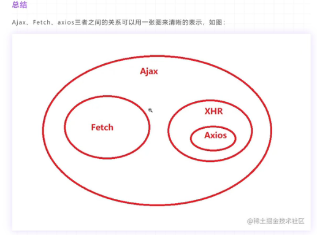

- [浏览器缓存](#浏览器缓存)
- [http缓存  304状态码  强缓存、协商缓存](#http缓存--304状态码--强缓存协商缓存)
- [重绘重排](#重绘重排)
- [浏览器渲染页面的流程](#浏览器渲染页面的流程)
- [url发起请求到页面获取，发生了什么？？](#url发起请求到页面获取发生了什么)
- [什么是堆内存，什么是栈内存](#什么是堆内存什么是栈内存)
- [什么是CSRF](#什么是csrf)
- [HTTP协议(状态码，八种请求方式，构成)](#http协议状态码八种请求方式构成)
- [什么是跨域，如何解决跨域问题](#什么是跨域如何解决跨域问题)
- [ajax, fetch, axios的区别](#ajax-fetch-axios的区别)
- [什么是栈内存，什么是堆内存](#什么是栈内存什么是堆内存)
- [解释cookies,sessionStorage,localStorage](#解释cookiessessionstoragelocalstorage)
- [解释：cookie session token 如何保持用户的登录状态](#解释cookie-session-token-如何保持用户的登录状态)
- [公钥，私钥，签名](#公钥私钥签名)
- [如何理解前后端分离](#如何理解前后端分离)
- [什么是MVVM](#什么是mvvm)
- [get和Post有什么区别](#get和post有什么区别)
- [常见的状态码](#常见的状态码)
- [常用的git命令](#常用的git命令)

# 浏览器缓存
# http缓存  304状态码  强缓存、协商缓存

# 重绘重排
# 浏览器渲染页面的流程
# url发起请求到页面获取，发生了什么？？
# 什么是堆内存，什么是栈内存
# 什么是CSRF
# HTTP协议(状态码，八种请求方式，构成)

[参考资料](https://www.bilibili.com/video/BV1f7411L7By?spm_id_from=333.337.search-card.all.click)

[参考资料](https://www.bilibili.com/video/BV1mQ4y1C7Cn?p=56)

# 什么是跨域，如何解决跨域问题

> 什么是跨域？

当一个请求url的`协议, 域名，端口号`三者之间任何一个与当前页面的url不同时，即为跨域

> 什么是同源策略?

同源策略是一种约定，即`协议，域名，端口号`三者需要相同，这是浏览器最基本最核心的安全功能，否则，容易受到XSS, CSRF攻击

> 如何解决跨域问题

JSONP：
  - 利用html元素中某些标签具有跨域功能，例如a, link script等。
  - 将请求地址写在src属性值里，并添加一个参数callback
  - 服务器接受了这个回调函数，返回的时候再把这个函数返回给客户端，并在里面添加数据
  - 客户端的callback函数由此接收到了由服务器传递过来的参数，即解决了跨域的问题
  - 他的缺点是只能发起get请求，参数携带在目标地址的后面

Proxy代理：
  - 这是Vue等项目中较为常见的一种解决方案，即配置一个代理服务器
  - 由于跨域问题只存在于浏览器，服务器与服务器之间并不存在，所以可以在当前域名下配置一台代理服务器作为数据的转发
  - webpack配置项中，有一个devServer,配置里面的proxy即可
  - ngnix反向代理，也是一样道理(主要用来做负载均衡用的)

CORS(跨域资源共享)
  - CORS是一个W3C标准，全称是"跨域资源共享"（Cross-origin resource sharing）。
  - 它允许浏览器向跨源服务器，发出XMLHttpRequest请求，从而克服了AJAX只能同源使用的限制。
  - 主要的解决方法是往响应头中添加 Access-Control-Allow-Origin: * 等类型的响应头
  - 这里的请求分为普通请求和复杂请求，复杂请求响应的东西要多一点，作为了解即可
[参考资料](https://blog.csdn.net/weixin_43641218/article/details/120436830)

#  ajax, fetch, axios的区别

  - Ajax: 异步的 javascript and xml , 它是一个技术统称，是一个模型概念，包含了很多的技术，最重要的特性就是让页面实现局部刷新， 例如XMLHttpRequest就是实现Ajax的一种方式而已
  - Fetch使用了ES6的Promise对象，它是XMLHttpRequest的替代品， 已经内嵌在浏览器中，是可以直接使用的，它是一个API
  - axios是对XMLHttpRequest进行的二次封装，也是基于promise，因为它是一个库，而不是一个简单的API，所以功能比较多，比如请求拦截，发送数据，返回数据的处理等

# 什么是栈内存，什么是堆内存
[参考资料](http://www.360doc.com/content/22/0515/12/78357527_1031445086.shtml)

# 解释cookies,sessionStorage,localStorage

相同点：

`cookie`: 

- cookie是存储在浏览器的数据。当浏览器发起请求的时候，会自动携带上这个cookie。
- cookie由服务器写入(set-cookie)， 其他两个是由前端自己写入进去的
- 常用的属性有：name value expire path domin (同一个域下面的数据是共享的)
- cookie的生命周期是expire设置的时间，时间一到就清除了
-  Cookie、SessionStorage、 LocalStorage数据共享都遵循同源原则，SessionStorage还限制必须是同一个页面。
-  存储大小：Cookie的存储大小约4kb， sessionStorage及localStorage存储空间比较大，大约5M
-  Cookie一般用于存储登录验证信息SessionID或者token，LocalStorage常用于存储不易变动的数据，减轻服务器的压力，SessionStorage可以用来检测页面是否刷新。

`localStorage sessionStorage`

- session用于存储会话中的数据，一个会话结束(例如浏览器关闭)，就消失了
- loaclStorage用于持久化存储数据，需要人为手动清除

# 解释：cookie session token 如何保持用户的登录状态

  - http是无状态的(服务器根本不知道访问者是谁，当然例如那种新闻网站，服务器根本不用知道你是谁，但是有些用户中心这样的网站，服务器一定要知道你是谁)，当你关闭网页，再次访问服务器的时候，服务器没有意识到又是你来访问它。那么，怎么让浏览器保持登录状态呢？

- 用户填写用户名+密码，随着请求发送给服务器
- 服务器拿到用户名+密码，和数据库存储信息进行比对，正确就实现登录
- 此时服务器将用户名+密码+过期时间等通过set-cookie写入cookie,并发送给浏览器保存
- 服务器下次发起请求的时候就会自动带上这个cookie，就能实现登录拉！！！而且cookie设置了有效期，过段时间就会失效，就又需要重新登录拉！！！

`但是问题是：我怎么能把用户名+密码直接写入cookie呢？？？别人不就都能拿到这个数据了吗！！！`

`解决方法一: session`

 - 可以把用户的登录信息保存在session,而这个session位于服务器(例如可以存入数据库)
 - 返回给客户端的是sessionID,并存入cookie中
 - 通过sessionID来找到对应的session，就知道这个请求是谁发出的
 - 缺点：1.客户端保留了很多的session会话信息，例如sessionID,谁登录了哪个网站，过期时间是多少，这样服务端压力太大。2.此外session不可以共享，那么另外一台服务器就拿不到session的信息，现在都是分布式的技术3.容易受到CSRF攻击

`解决方法二：token`

- 服务器生成的是token而不是sessionID,利用JWT技术(JSON WebToken)
- Token被发送给客户端，一般都是存放咋localStorage中,服务端就保存JWT签名的密文(都是一样的)
- 下次发送请求token被放在请求头中 header:{Authorization: 'Bearer XXXX'}

`补充知识JWT`
JWT(JSON web token)：就是生成token的一种技术。格式是：Header.Payload.Signature.

- header:声明用什么算法生成签名
- payload:特定的数据(我理解的用户信息就可以保存在这里，例如：我是谁？？)
- signature: head和payload利用Base64编码后，结合head声明的加密算法，生成数字签名

header和payload利用base64进行编码，所以可以解密，所以需要signature进行签名加密。可以在这个网站 https://jwt.io/ 进行实验

看文件夹 cookie_session_token学习 

#  公钥，私钥，签名

`公钥`：用户用来对信息加密

`私钥`：接收者用来解密

有一个信箱，有两个锁，其中一个锁钥匙(公钥)有很多份，你的朋友拥有这个锁，就能往里面投信息。另一个锁(私钥)只有你拥有，所以只有你才能打开信箱，查看朋友发来的信息 [参考资料](https://www.bilibili.com/video/BV1Cg411j7WU?spm_id_from=333.337.search-card.all.click&vd_source=60248c7c7bc979b113e0ac4403b63220)

`签名`：利用加密算法和一些数据，生成的数字签名

# 如何理解前后端分离

总结：前后端分离就是将一个单体应用拆分成两个独立的应用：前端应用和后端应用，以JSON格式进行数据交互

前后端分离不是一个技术性的问题。而是一个工程化管理方面的问题。

把数据+模板拼接到一起，这就叫渲染

最早期的时候(前后端不分离)，web页面的渲染都是在服务端完成的，即服务端运行过程中，将所需要的数据结合页面模板渲染为html，所以浏览器呈现的是包含全部内容的页面。这种做法是把前端的代码和后端揉在了一起，当页面应用较为复杂的时候，工作量会很大。

且不能起到代码片段复用的效果。而现在前后端分离，组件式开发，就很好解决了这些痛点，且前后端通过接口进行交互。不存在一些扯皮的事情。但是在网页并不复杂的情况下，这种方式也是可取的。

以前，一个网址就是一个页面，每次都要渲染新的页面。前后端分离是单页面的引用，通过渲染DOM树来进行内容的切换

# 什么是MVVM

`MVC： model-view-controller`

model: 数据层

view: 视图层(html代码构成的页面)

controller: 需要操作DOM，然后给DOM绑定一些事件来控制它，是单向的。

用户在view修改了数据，然后修改通知了controller， 然后控制model数据发生了变化。但是当数据发生变化，通常是通过DOM操作，然后去修改view中的内容，这样代码的耦合性就会变高！！！

`MVVM: model-view-viewModel`

它是对MVC的改进， MVC也是想让model和view分开

model:数据层，负责数据的存储和一些业务的逻辑(发送请求等)

view: 视图层，就是html页面构成

viewModel: 连接model和view，负责路由的切换，数据双向绑定，自动更新视图， 路由的切换等
# get和Post有什么区别

- get参数在url里面(url长度受限，最大为2048字符，且如果参数是中文，需要被编码)，Post在请求体里面
- get请求可以被浏览器缓存，Post请求不可以被缓存
- get请求参数在url里面，安全性较差，Post放在请求体中则安全性相对较好
- get请求支持浏览器直接方法，支持刷新和后退，Post请求则不可以

# 常见的状态码

- 200： 表示响应正常
- 3xx: 表示重定向，服务器要求客户端请求一个新的URL
- 304：通俗点来理解：为了提高网站访问速度，服务器给访问过的某些页面设置了缓存机制。当客户端请求这些页面时，服务器将根据缓存的内容判断页面是否更新过，如果页面未更新过，它就会返回一个304状态码，这时客户端直接调用缓存的内容，而不必进行第二次调用及下载。
- 400：客户端请求的语法不对，服务器无法理解，例如多了空格，参数名称不对等
- 401： 未授权，需要身份认证
- 403： 服务端禁止访问
- 404：请求的资源未找到
- 405：请求方法不允许
- 5xx: 服务端错误，需要服务端查看日志做出进一步处理

# 常用的git命令

- `git init`: 将项目加入git版本管理，目录下多了.git文件，使用ls看不到这个文件夹， 需要使用ls -ah
- `git config --global --list`: 查看全局的配置， global可以换成local
- `git config --global --user.name "mianmami"`: 设置用户名
- `git config --global --user.email "760776821@qq.com"`：设置邮箱
- `git add XX  git add .` : 把文件从工作区加入暂存区
- `git commit -m '备注'`: 把文件从暂存区添加到版本库
- `git status`: 查看文件的状态，如果还在工作区是红色，如果还在暂存区是绿色
- `git log   简写：git log --pretty=oneline`：查看日志，显示一共git commit了多少内容
- `git remote -v`: 查看本地仓库与哪些远程仓库链接
- `git remote rm <ssh地址>`:断开与远程仓库的链接
- `git remote add origin <ssh地址>`：添加与远程仓库的链接，add origin表示这个仓库的别名，origin可以改
- `git push --set-upstream origin master:master`
  - --set-upstream可以简写为-u, 表示记住这一次的设置，下次直接git push即可
  - origin表示push的仓库名称
  - origin master:master表示：本地仓库的master分支中的文件上传到 本地别名为origin的远端仓库的master分支中。
  - 整句话可以简写为git push --u origin master
  - 如果还没有创建本地仓库，那么需要提前创建。(注意：vue-cli已经帮我们init了项目，可以通过git log进行查看)
- `git branch`: 查看本地的分支
- `git branch -r`: 查看远程仓库的分支
- `git branch 名字 ID号`: 创建一个分支 ID号是以某个事件点地代码，创建一个分支出来， 如果没有的话，就是git branch XX 
- `git branch XX`: 创建一个分支
- `git checkout XX`: 切换到一个分支上
- `git checkout -b XX`: 创建一个分支，并立即切换到该分支
- `git brahch -d XX`: 删除一个分支
- `git merge XX`: 先切换到一个新的分支上，再把旧的内容添加到新的分支里
- `it restore <file>`: 撤销修改的文件，注意此文件必须还未操作git add 命令。如果已经添加到了暂存区，那么先要执行 `git restore --staged <file>`
- 注意：如果一个文件夹中没有README.md，然后想要推送到github，会报错的。。。。。。。。。。。。
- 如果要忽略一个文件夹，就创建一个.gitignore文件，然后  每一行添加一个要忽略的文件即可 例如： /test    /test/dist
- 如果想要跟踪一个文件夹，但是不跟踪文件夹里的内容，可以在这个文件夹下 自定义一个叫做  .gitkeep的文件
- 

